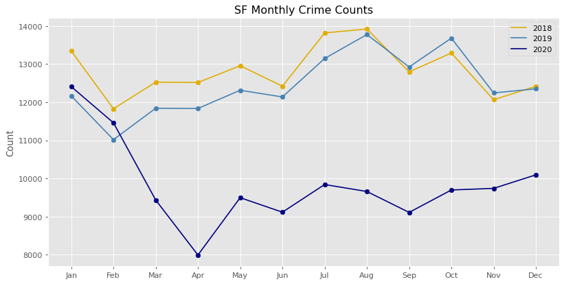
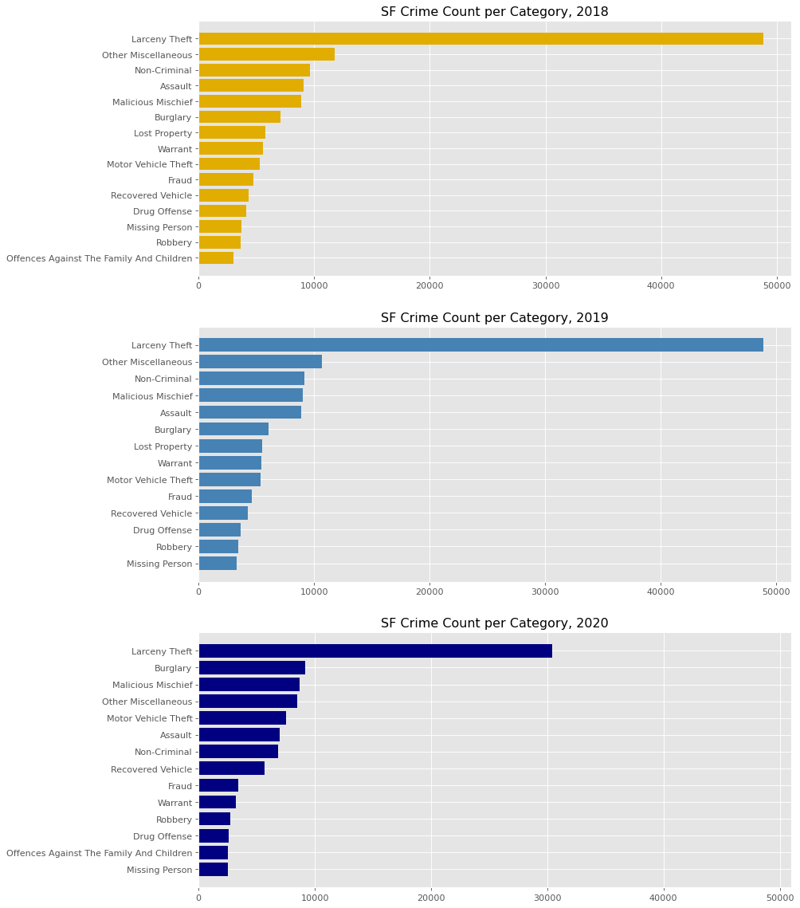
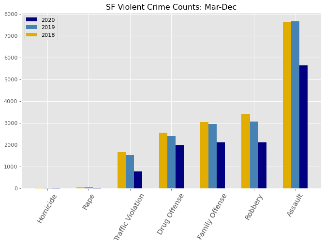
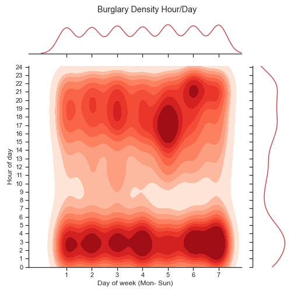

# San Francisco Crime Analysis

## Background & Motivation

Criminal researches have confirmed that there are clear patterns of crime, with concentrations in specific places at specific times. Studying crime patterns can help authorities to identify crime hotspots and guide desicion makers to implement more sustainable solutions at macro and micro scales.

In this EDA, I used SF Police Department Incident Reports (2018-2020) to answer the following questions:

- Has San Francisco become safer during the pandemic? 
- Did the pandemic affect crime rates in the city?
- Which crimes are more frequent?
- What is the current crime behavior?

## Data
[SF Police Department Incident Reports (2018-2020)](https://data.sfgov.org/Public-Safety/Police-Department-Incident-Reports-2018-to-Present/wg3w-h783)  
[SF Neighborhoods shape file and geojason data](https://data.sfgov.org/Geographic-Locations-and-Boundaries/Analysis-Neighborhoods/p5b7-5n3h)

City of San Francisco Open Data Catalog has police reports dataset which is updated frequently. For this analysis I used data from 2018-2020. The cleaned dataset has 446631 rows and 26 columns. This dataset has geomtery points as well as crime information. 

To plot the data on the maps, I used the geojason files from the same source.

## Exploratory Data Analysis
After importing and extracting the columns I needed in `pandas`, I took an overall look at the crime counts. Crime count in 2020 is **21% less** than 2019.

 Should I be comfortable to announce San Francisco as a safe city?
 Next step is to take a closer look. Below graph shows how crime rate was more or less the same pattern as before in 2020, until shelter-in-place was ordered on March 17, 2020. 
Dramatic drop in crime rates!
  
  

Graphs below show the crime count per category in the past three years. It seems Larceny theft is still leading in 2020.

Crime Types:

Voilent Crimes |Property Crimes
 ---|---
Homicide| Burglary
Rape| Larceny theft
Robbery | Auto theft
Assult |Arson
Drug Offense

Property crimes happen more frequently compared to violent crimes. 

40% percent of San Francisco crimes in 2020 from March to end of December is property and only 13.4% percent is violent crimes.

Graphs below compare the total counts of each categorty in the past three years, March- December.

Violent crimes are decreased according to the data. It makes sense because there is less people out and about but also there might be some data missing in categories like Rape or Family Offense.

#### There is Big increases in some non-violent crimes. 
Larceny Theft is decreased by 18536 count but there are 2997 more Burglaries and 1980 more Motor Vehicle Thefts compared to 2019.

Looking closely at the subcategories of crime, 

There is a chance that with further analysis we conclude the financial impact of each crime is higher.

Petty thefts are lower but there are more burglaries and vehicle or auto parts theft.

A "Hot Prowl" is a burglary when a subject enters, or attempts to enter your home while someone is home. A hot prowl burglary is dangerous because of the possible confrontation between the subject and victim.
1008 hot prowls in 2020
511 hot prowls in 2019

## When do Burglaries and Vehicle Thefts happen?
I expected to see a pattern in incident times.
The following kernel density estimation (KDE) joint-plots shows this expectation and reveals that late late to early morning is particularly bad for burglary between 1am and 5pm except for Fridays and I assume that's because more poeple are out of their houses in the evevning and more burglaries happen around that time. 

  On the other hand, the peak time for vehicle theft is between 4pm to 9pm, during weekdays. Friday night is the busiest time for auto thefts too!  
 

## Burglary and Vehicle Theft hot spots
Maps below -made with Folium- show which neighborhoods are hotspots for burglary and vehicle theft in 10 months of 2020. 

Now that we know those areas, we can take a closer look at each site to detect the problematic nodes and implement action plans. 
Mission is one of the neighborhoods with high rates in both of the crime types.

Map below is also made with Folium and shows the critical nodes for both Burglary (red bubbles) and Vehicle Theft (blue bubbles) and the radius represents incident counts.

## Next Steps:
1- Build machine learning models such as KNN or Random Forest for crime prediction.
2- Update data frequently to compare crime behaviour changes through time.
3- Compare SF crime rate with the rest of the Bay Area. Has the crime locations shifted during the pandemic?
