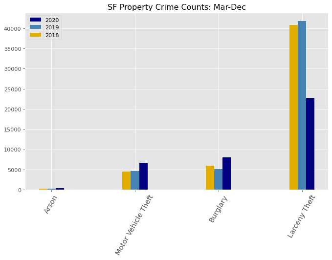
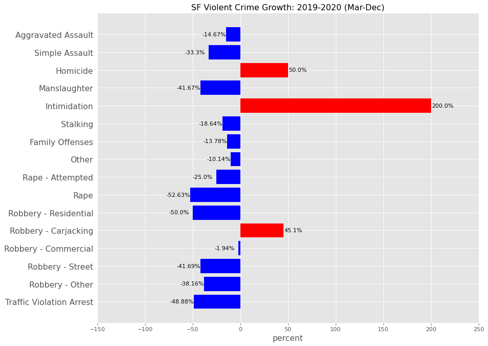
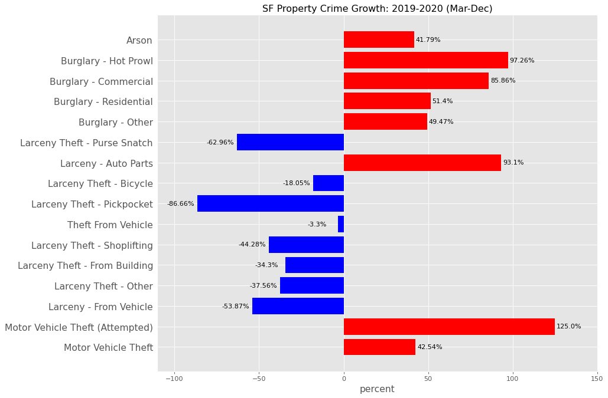
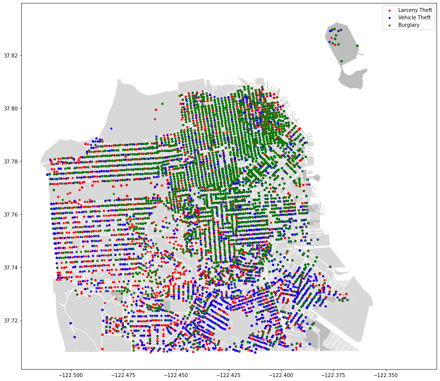

# San Francisco Crime Analysis

## Background & Motivation

Criminal researches have confirmed that there are clear patterns of crime, with concentrations in specific places at specific times. Studying crime patterns can help identifying crime hotspots and guide desicion makers to implement more sustainable solutions at macro and micro scales.

In this EDA, I used SF Police Department Incident Reports (2018-2020) to answer the following questions:

- Is San Francisco becoming safer? 
- Did the pandemic affect crime rates in the city?
- Which crimes are more frequent?
- What is the current crime behavior?

## Data
[SF Police Department Incident Reports (2018-2020)](https://data.sfgov.org/Public-Safety/Police-Department-Incident-Reports-2018-to-Present/wg3w-h783)  
[SF Neighborhoods shape file and geojason data](https://data.sfgov.org/Geographic-Locations-and-Boundaries/Analysis-Neighborhoods/p5b7-5n3h)

City of San Francisco Open Data Catalog has police reports dataset which is updated frequently. For this analysis I used data from 2018-2020. The cleaned dataset has 446631 rows and 26 columns. This dataset has geomtery points as well as crime information. 

To plot the data on the maps, I used the geojason files from the same source.

## Exploratory Data Analysis
After importing and extracting the columns I needed in `pandas`, I took an overall look at the crime counts. Crime count in 2020 is **21% less** than 2019.

 Should I be comfortable to announce San Francisco as a safe city?
 Next step is to take a closer look. Below graph shows how crime rate was more or less the same pattern as before in 2020, until shelter-in-place was ordered on March 17, 2020. 
Dramatic drop in crime rates!
  
  

Graphs below show the crime count per category in the past three years. It seems Larceny theft is still leading in 2020.

Crime Types:

 Voilent Crimes | Property Crimes
 ---|---
 Homicide| Burglary
 Rape| Larceny theft
Robbery | Auto theft
Assult |Arson
Human trafficking
crime comparison based on type

  
   

#### Big increases in some non-violent crimes

Burglary and Motor Vehicle Theft have grown over the past year.(March- Dec)

Map below is made with geopandas and shows where each crime happened over those 10 months. 

### Motor Vehicle Theft Pattern:

## Later
reported vs. not reported